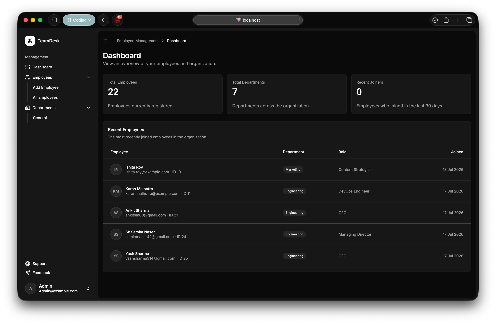
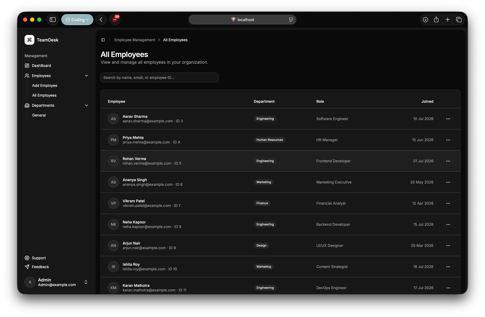
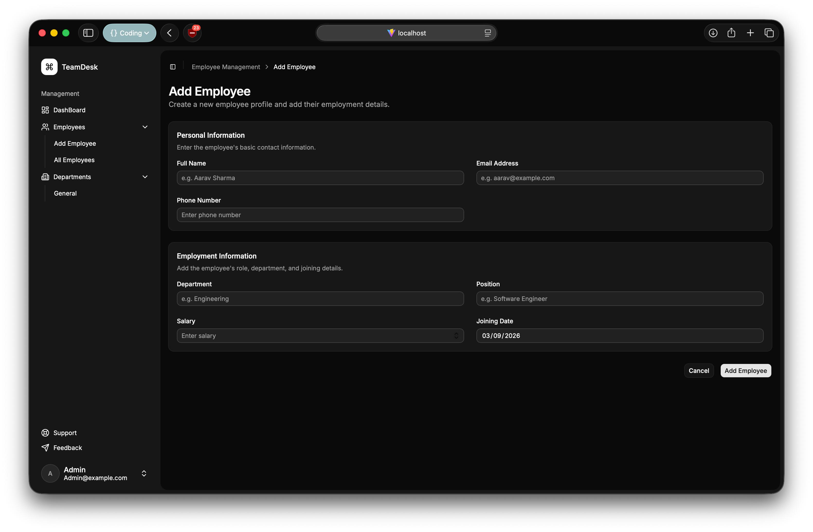

# Team Desk

A full-stack employee management application for storing, viewing, updating, and deleting employee records. The project uses a React frontend, a Flask REST API, and a MySQL database.

## Features

- View all employees in a dashboard/table interface
- Add new employees with validated email and phone input
- Update employee profile and contact information
- Delete employee records
- Store contact information in a separate related table
- MySQL-backed persistent storage

## Screenshots

### Dashboard



### All Employees



### Add Employee



## Tech Stack

**Frontend**

- React
- TypeScript
- Vite
- Tailwind CSS
- ShadCN

**Backend**

- Python
- Flask
- Flask-CORS
- MySQL Connector/Python
- email-validator
- phonenumbers

**Database**

- MySQL

## Project Structure

````text
employee-management/
├── backend/
│   ├── app.py
│   ├── database.py
│   └── requirements.txt
└── frontend/
    ├── public/
    │   ├── add-employee.jpeg
    │   ├── all-employee.jpeg
    │   └── dashboard.jpeg
    ├── src/
    ├── package.json
    └── vite.config.ts

## Database Design

The database is named:

```text
employee_management
````

The current schema uses two tables:

```text
employees
- id
- name
- department
- position
- salary
- joining_date

employee_contacts
- id
- employee_id
- email
- phone
```

`employee_contacts.employee_id` references `employees.id`, so each employee can have one related contact record. The API joins both tables internally and returns employee records in a simple format for the frontend.

## Backend Setup

Go to the backend folder:

```bash
cd backend
```

Create and activate a virtual environment:

```bash
python3 -m venv venv
source venv/bin/activate
```

Install dependencies:

```bash
pip install -r requirements.txt
```

Make sure MySQL is running and that [backend/database.py](backend/database.py) points to your local database credentials.

Run the Flask API:

```bash
python app.py
```

The backend runs on:

```text
http://localhost:5001
```

## Frontend Setup

Go to the frontend folder:

```bash
cd frontend
```

Install dependencies:

```bash
npm install
```

Start the development server:

```bash
npm run dev
```

The frontend usually runs on:

```text
http://localhost:5173
```

## API Endpoints

### Health Check

```http
GET /
```

Returns:

```json
{
  "message": "Employee Management API"
}
```

### Get All Employees

```http
GET /employees
```

Returns all employees with contact details joined from `employee_contacts`.

### Get Employee By ID

```http
GET /employees/:id
```

Returns one employee by ID.

### Add Employee

```http
POST /employees
```

Example body:

```json
{
  "name": "Sk Samim Naser",
  "email": "samim.naser@example.com",
  "phone": "9876543210",
  "department": "Engineering",
  "position": "Software Developer",
  "salary": 95000,
  "joining_date": "2026-07-17"
}
```

### Update Employee

```http
PATCH /employees/:id
```

Example body:

```json
{
  "department": "Finance",
  "position": "Accounts Manager",
  "salary": 68000
}
```

### Delete Employee

```http
DELETE /employees/:id
```

Deletes the employee and their related contact record.

## Validation

The backend validates:

- `name` and `email` are required when creating an employee
- `email` must be a valid email format
- `email` must be unique
- `phone` must be a valid Indian phone number when provided
